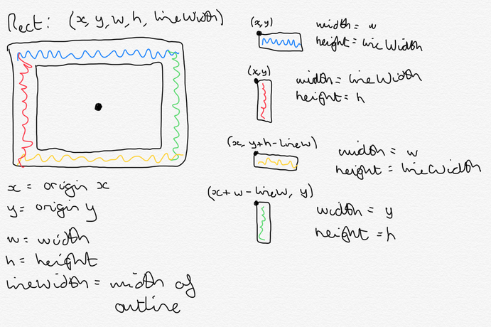
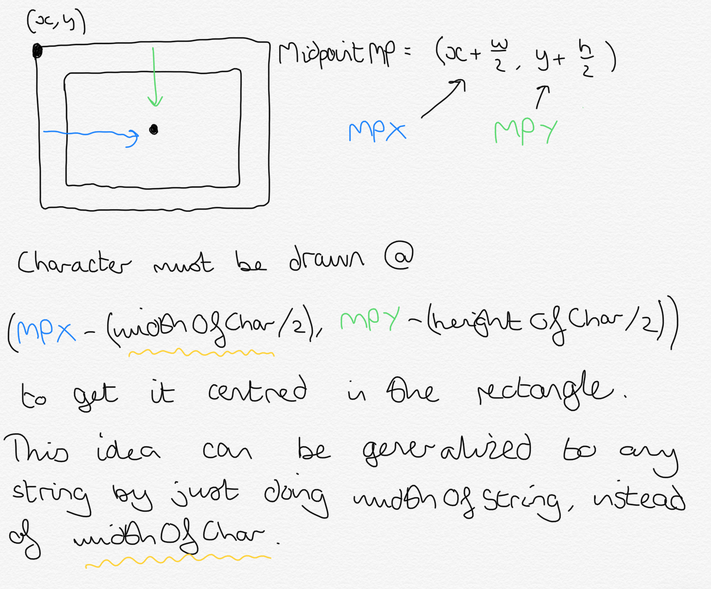

# Notes on the P8 smartwatch
## Battery
- On my development watch, I soldered in a small connector from (I think) a quadcopter
- I also replaced the stock battery wires with the corresponding male connector
- This allows me to easily connect and disconnect the battery for testing purposes (seen in the section Internal Images)
## Display
### LCD
- Aaron Christophel used a rect based implementation for writing characters to the screen
  - This involved working through the font, writing rects (squares) everywhere there is a pixel
  - This was fast enough for most text displaying needs, however it was noticeably slow when writing a full screen of text
  - One factor of the slow speed was to do with the fact that the whole _write into display RAM_ sequence was run 5*8=40 times per character
- My implementation does the work before writing, writing pixel data into the LCD Buffer directly, then using EasyDMA to write that whole buffer into display RAM
  - This is different to Aarons, which draws a rect for each pixel
  - This implementation is faster still than Aarons implementation, and by the naked eye, writing a full screen of text is equally as fast as drawing a rect equal to the display size (theoretically the fastest you could write to the display)
    - As an aside, writing a full 240\*240 rect to the display would take approximately (1/8000000\*16\*240\*240) seconds, or about 0.1 seconds
- There are still further optimizations that could be made to this routine (and parameterising it for use with different fonts), however I am happy with the current implementation

#### Drawing A Character
- ATCWatch's implementation was very inefficient in that it drew a rectangle for each pixel of the font
  - This meant the display RAM write window was moved FONT_WIDTH*FONT_HEIGHT times per character, so was quite slow  

My implementation is described here:
- We have
  - A font size (number of lcd pixels per font pixel)
  - A display pixel x offset from the character top-left corner [0 : (FONT_WIDTH*pixelsPerPixel)-1]
  - A display pixel y offset from the character top-left corner [0 : (8*pixelsPerPixel)-1]
  - A boolean saying whether there is a pixel there
- shouldPixelBeHere takes a font x,y (with 0 <= x < FONT_WIDTH and 0 <= y < FONT_HEIGHT), and returns a boolean as to whether there should be a pixel there
  - This x,y is to do with font pixels, NOT display pixels
- We need a function that takes:
  - The font pixel x,y
  - The number of pixels per pixel
  - A bool as to whether there is a pixel in (x,y) in the font or not
  - The pixel colour
- Which loops through pixelsPerPixel^2 times and writes to the correct TWO positions in the lcd buffer array the colour
___

- If the lcdBuffer was a single byte per pixel, we could get the element of the array that (x,y) represents by
  - Scaling the font position up by the number of pixels per display pixel (x*pixelsPerPixel and y*pixelsPerPixel)
    - This will give the origin of that pixel in the display character window
  - We must then do the for loop at this point, adding i/j to the new origin positions as an offset so that we now have a coordinate in the display window for every sub-pixel of the current pixel we are on
  - We can get the number of pixels in a row by doing pixelsInRow = FONT_WIDTH*pixelsPerPixel
  - Now if the lcdBuffer was a single byte per pixel, we could just do
  - lcdBuffer[newYAddOffset*pixelsInRow + newXAddOffset] to get the position in the buffer of the current pixel we are on
    - This is because the display windows fills from top left, top row first, meaning that the offset of the current display pixel is just the y*pixelsPerRow, add the x value
  - Since there are two bytes per pixel however, we must edit the expression that accesses the buffer to take this into account.
  - So now the MSByte index of a pixel will be twice the current index, and the LSByte index will be that plus 1
  
- In explicit form, this looks like:

```cpp
void drawCharPixelToBuffer(int charColumn, int charRow, uint8_t pixelsPerPixel, bool pixelInCharHere, uint16_t colour) {
  //Get the row and column of the origin of the current FONT pixel as a DISPLAY position
  //by scaling by the font size
  int columnFontIndexScaledByPixelCount = charColumn * pixelsPerPixel;
  int rowFontIndexScaledByPixelCount = charRow * pixelsPerPixel;
  //Get the number of display pixels per character row
  int pixelsPerRow = FONT_WIDTH * pixelsPerPixel;
  int newXAddOffset, newYAddOffset;
  //Loop through every display pixel in the current FONT pixel
  for (int i = 0; i < pixelsPerPixel; i++) {
    for (int j = 0; j < pixelsPerPixel; j++) {
      //Handle the current offsets from the origin calculated above
      newXAddOffset = columnFontIndexScaledByPixelCount + j;
      newYAddOffset = rowFontIndexScaledByPixelCount + i;
      //Write to the LCD buffer using the logic presented above
      lcdBuffer[2*(newYAddOffset * pixelsPerRow + newXAddOffset)] = pixelInCharHere ? (colour >> 8) & 0xFF : 0x00;
      lcdBuffer[2*(newYAddOffset * pixelsPerRow + newXAddOffset) + 1] = pixelInCharHere ? colour & 0xFF : 0x00;
    }
  }
}
```
- Writing a full page of size 2 font is as fast as clearing the display :)

#### Drawing Rectangle Outlines with Text





### Touch
- The touch controller used in the P8 is the CST716S, rather than the CST816S
- It seems to be an equivalent controller in terms of data output
- However this display controller cannot go into sleep mode and wake up with a tap
  - To wake it up, you must toggle the reset pin
- This means if you want tap-to-wake, you must settle with a ~3mA current draw, which is very bad
- Also, the display has a different swipe behaviour in that if you swipe a direction without removing your finger, the 816 will register the swipe, whereas the 716 will only register it when the finger is removed
## RTC
- A bug I found in the millis() function causes the millis() function to wrap over about every 2 days (caused by &ing the overflow bits with 0xff meaning they wrap prematurely)
  - An issue has been filed with arduino-nRF5 (https://github.com/sandeepmistry/arduino-nRF5/issues/417) but the project is inactive now, so if you use that library, be sure to fix that bug to get propper 32 bit millis() functionality
## Heartrate sensor
- There are two LEDs on the heartrate sensor board, however these are independently controllable separate to the heartrate sensor itself (which has its own LED in the package) through pin 27


## Accelerometer
## Implementation of Screens as Classes

___
# Internal Images


