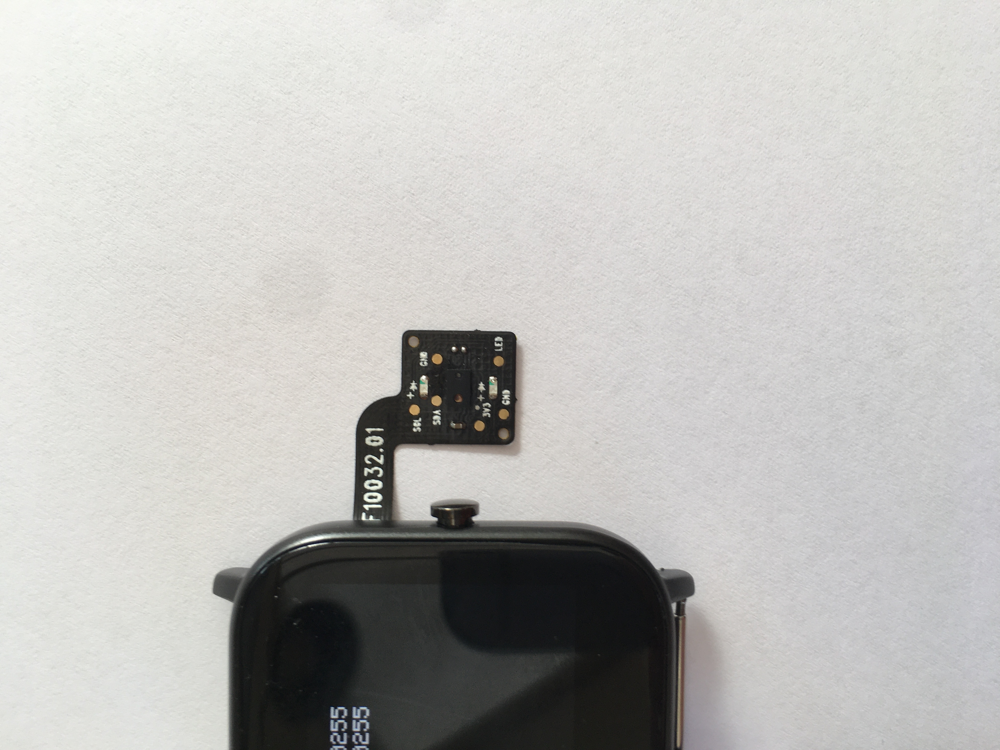
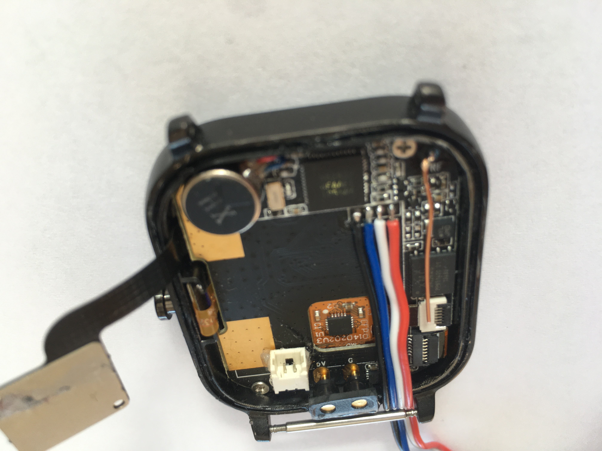
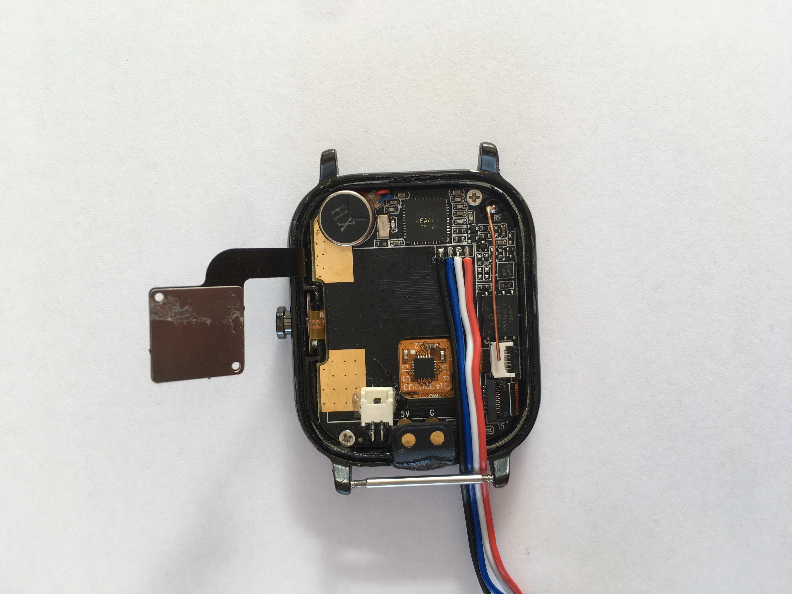

# Notes on the P8 smartwatch
## Battery
- On my development watch, I soldered in a small connector from (I think) a quadcopter
- I also replaced the stock battery wires with the corresponding male connector
- This allows me to easily connect and disconnect the battery for testing purposes (seen in the section Internal Images)
## Display
### LCD
- Aaron Christophel used a rect based implementation for writing characters to the screen
  - This involved working through the font, writing rects (squares) everywhere there is a pixel
  - This was fast enough for most text displaying needs, however it was noticeably slow when writing a full screen of text
  - One factor of the slow speed was to do with the fact that the whole _write into display RAM_ sequence was run 5*8=40 times per character
- My implementation does the work before writing, writing pixel data into the LCD Buffer directly, then using EasyDMA to write that whole buffer into display RAM
  - This is different to Aarons, which draws a rect for each pixel
  - This implementation is faster still than Aarons implementation, and by the naked eye, writing a full screen of text is equally as fast as drawing a rect equal to the display size (theoretically the fastest you could write to the display)
- There are still further optimizations that could be made to this routine (and parameterising it for use with different fonts), however I am happy with the current implementation
### Touch
- The touch controller used in the P8 is the CST716S, rather than the CST816S
- It seems to be an equivalent controller in terms of data output
## RTC
- There is a 32768KHz oscillator in the main CPU, however I am still researching how to use that for RTC needs (and whether the `millis()` function uses that or the base system clock for timing)
- Using the stock Time library, the time deviates by +1 second after about 17-18 hours of uptime
  - I am fine with a total delta of up to +-30 seconds, so I am more than happy with the current deviation
## Heartrate sensor
- There are two LEDs on the heartrate sensor board, however these are independently controllable separate to the heartrate sensor itself (which has its own LED in the package) through pin 27

## Accelerometer

## Internal Images

$\text{This is a test of inline latex}$